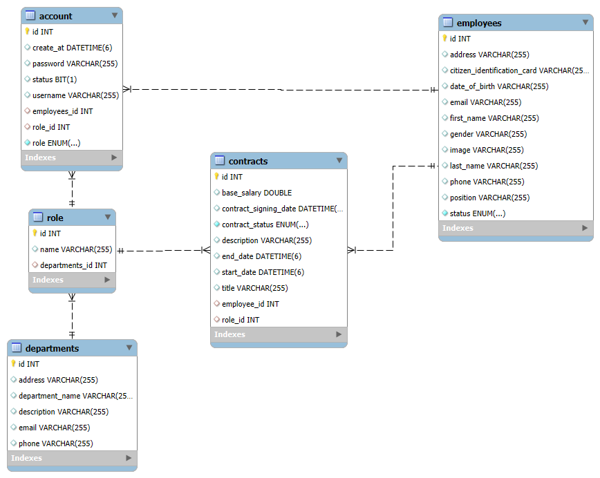
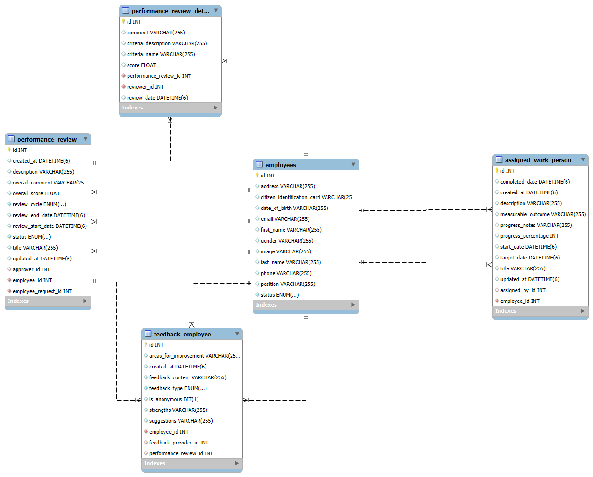

# HRM - Human Resource Management System

## 📋 Mục lục
- [Giới thiệu](#giới-thiệu)
- [Tính năng](#tính-năng)
- [Công nghệ sử dụng](#công-nghệ-sử-dụng)
- [Cài đặt](#cài-đặt)
- [Cấu hình](#cấu-hình)
- [API Documentation](#api-documentation)
- [Cấu trúc dự án](#cấu-trúc-dự-án)
- [Đóng góp](#đóng-góp)
- [Giấy phép](#giấy-phép)

## 🚀 Giới thiệu

HRM (Human Resource Management) là một hệ thống quản lý nhân sự toàn diện, được phát triển bằng Java Spring Boot. Hệ thống cung cấp các tính năng quản lý nhân viên, tuyển dụng, chấm công, tính lương, đào tạo và đánh giá hiệu suất.

## ✨ Tính năng

### 👥 Quản lý Nhân viên
- Quản lý thông tin cá nhân nhân viên
- Quản lý người phụ thuộc
- Quản lý hồ sơ ảnh đại diện
- Phân quyền và vai trò

### 🏢 Quản lý Tổ chức
- Quản lý phòng ban
- Quản lý vai trò và chức vụ
- Cấu trúc tổ chức phân cấp

### 📋 Tuyển dụng
- Quản lý yêu cầu tuyển dụng
- Quản lý hồ sơ ứng viên
- Quản lý quy trình phỏng vấn
- Gửi thư mời phỏng vấn và thông báo tuyển dụng


### 📝 Hợp đồng
- Tạo và quản lý hợp đồng lao động
- Theo dõi trạng thái hợp đồng
- Tạo báo cáo hợp đồng



### ⏰ Chấm công
- Chấm công check-in/check-out
- Quản lý ca làm việc
- Tính toán giờ làm việc và giờ tăng ca
- Quản lý ngày nghỉ phép

### 💰 Tính lương
- Quản lý chu kỳ lương
- Tính toán các thành phần lương
- Quản lý bảng lương
- Áp dụng quy định lương


### 📊 Đánh giá hiệu suất
- Quản lý đánh giá hiệu suất
- Quản lý chi tiết đánh giá
- Phản hồi từ nhân viên
- Báo cáo hiệu suất



### 🎓 Đào tạo
- Quản lý chương trình đào tạo
- Quản lý phiên đào tạo
- Đăng ký tham gia đào tạo
- Theo dõi yêu cầu đào tạo


### 📄 Quản lý Tài liệu
- Quản lý tài liệu hệ thống
- Phân quyền truy cập tài liệu
- Quy trình phê duyệt tài liệu
- Lưu trữ và tìm kiếm tài liệu


### 🏆 Khen thưởng & Kỷ luật
- Quản lý khen thưởng
- Quản lý kỷ luật
- Theo dõi lịch sử khen thưởng/kỷ luật

### 📈 Thống kê & Báo cáo
- Thống kê nhân viên theo phòng ban
- Thống kê hợp đồng theo trạng thái
- Báo cáo tài chính
- Dashboard tổng quan

## 🛠️ Công nghệ sử dụng

- **Backend**: Java 17, Spring Boot 3.x
- **Database**: MySQL
- **Security**: Spring Security, JWT
- **Documentation**: Swagger/OpenAPI 3
- **Email**: Spring Mail
- **File Storage**: Cloudinary (cho hình ảnh và file)
- **Build Tool**: Maven
- **ORM**: Spring Data JPA/Hibernate

## 🔧 Cài đặt

### Yêu cầu hệ thống
- Java 17 hoặc cao hơn
- Maven 3.8+
- MySQL 8.0+

### Bước 1: Clone repository
```bash
git clone https://github.com/NKhanh0908/hrm.git
cd hrm
```

### Bước 2: Cấu hình database
Tạo database trong MySQL:
```sql
CREATE DATABASE hrm;
```

### Bước 3: Cấu hình ứng dụng
Copy file cấu hình mẫu:
```bash
cp src/main/resources/application.properties.example src/main/resources/application.properties
```

### Bước 4: Cài đặt dependencies
```bash
mvn clean install
```

### Bước 5: Chạy ứng dụng
```bash
mvn spring-boot:run
```

Ứng dụng sẽ chạy tại: `http://localhost:8080`

## ⚙️ Cấu hình

### application.properties
```properties
# Database Configuration
spring.datasource.url=jdbc:mysql://localhost:3306/hrm
spring.datasource.username=your_username
spring.datasource.password=your_password

# JPA Configuration
spring.jpa.hibernate.ddl-auto=update
spring.jpa.show-sql=true

# Mail Configuration
spring.mail.host=smtp.gmail.com
spring.mail.port=587
spring.mail.username=your_email@gmail.com
spring.mail.password=your_app_password

# File Upload Configuration
spring.servlet.multipart.max-file-size=10MB
spring.servlet.multipart.max-request-size=10MB

# Cloudinary Configuration (for image storage)
cloudinary.cloud-name=your_cloud_name
cloudinary.api-key=your_api_key
cloudinary.api-secret=your_api_secret
```

### Biến môi trường
Có thể sử dụng biến môi trường cho production:
```bash
export DB_URL=jdbc:mysql://localhost:3306/hrm_db
export DB_USERNAME=your_username
export DB_PASSWORD=your_password
export MAIL_USERNAME=your_email@gmail.com
export MAIL_PASSWORD=your_app_password
```

## 📚 API Documentation

Sau khi chạy ứng dụng, truy cập Swagger UI tại:
```
http://localhost:8080/api/v1/swagger-ui/swagger-ui/index.html
```

### Các endpoint chính:

#### Authentication
- `/auth/signin` - Đăng nhập
- `/auth/signup` - Đăng ký tài khoản

#### Employees
- `/employees` - Lấy danh sách nhân viên
- `/employees` - Tạo nhân viên mới
- `/employees/{id}` - Lấy thông tin nhân viên
- `/employees/{id}` - Cập nhật thông tin nhân viên

#### Attendance
- `/attendance/checkin` - Chấm công vào
- `/attendance/checkout` - Chấm công ra
- `/attendance/employee/{id}` - Lịch sử chấm công

#### Payroll
- `/payroll/calculate` - Tính lương
- `/payroll/employee/{id}` - Bảng lương nhân viên

## 📁 Cấu trúc dự án

```
hrm/
├── src/
│   ├── main/
│   │   ├── java/
│   │   │   └── com/
│   │   │       └── project/
│   │   │           └── hrm/
|   |   |               |__ configuration/   # Config
│   │   │               ├── controllers/     # REST Controllers
│   │   │               ├── dto/             # Data Transfer Objects
│   │   │               ├── entities/        # JPA Entities
│   │   │               ├── enums/           # Enumerations
│   │   │               ├── exception/       # Exception Handling
│   │   │               ├── logging/         # Logging 
│   │   │               ├── mapper/          # Mapper DTO Entity
│   │   │               ├── repositories/    # Data Access Layer
│   │   │               ├── services/        # Business Logic
│   │   │               |    └── impl/          # Implement service
│   │   │               ├── specifications/  # Specification Excutor
│   │   │               └── utils/           # Utility Classes
│   │   └── resources/
│   │       |   └── fonts/          # Font Arial
│   │       |   └── reports/        # Create pdf 
│   │       ├── application.properties
│   │       ├── jasperreports_extension.properties
│   │       ├── logback-spring.xml
│   └── test/
├── pom.xml
├── README.md
└── .gitignore
```

## 🔒 Bảo mật

- Xác thực JWT token
- Mã hóa mật khẩu bằng BCrypt
- Phân quyền dựa trên vai trò (Role-based Access Control)
- Validation đầu vào
- CORS configuration
- Rate limiting (khuyến nghị)

## 📝 Logging

Ứng dụng sử dụng SLF4J với Logback:
- Log level có thể cấu hình trong `application.properties` và `logback-spring.xml`
- Log files được lưu trong thư mục `logs/`
- Rotation logs theo ngày

## 🧪 Testing
...

## 🚀 Deployment
...

### Docker
...

## 📊 Monitoring

Khuyến nghị sử dụng:
- Spring Boot Actuator cho health checks
- Micrometer với Prometheus cho metrics
- ELK Stack cho log aggregation

## 🤝 Đóng góp

1. Fork repository
2. Tạo feature branch (`git checkout -b feature/AmazingFeature`)
3. Commit changes (`git commit -m 'Add some AmazingFeature'`)
4. Push to branch (`git push origin feature/AmazingFeature`)
5. Tạo Pull Request

### Coding Standards
- Sử dụng Java Code Style chuẩn
- Viết unit tests cho các tính năng mới
- Tuân thủ nguyên tắc SOLID
- Viết javadoc cho public methods

## 📋 Changelog

### v1.0.0 (2024-01-15)
- Phiên bản đầu tiên
- Quản lý nhân viên cơ bản
- Chấm công và tính lương
- Quản lý tuyển dụng

## 🐛 Bug Reports

Nếu bạn tìm thấy lỗi, vui lòng tạo issue với:
- Mô tả lỗi chi tiết
- Các bước tái tạo lỗi
- Môi trường (OS, Java version, etc.)
- Screenshots (nếu có)

## 📞 Liên hệ

- **Email**: 
- **Website**: 
- **Documentation**:

## 📄 Giấy phép
...

**Được phát triển bởi HRM Team**