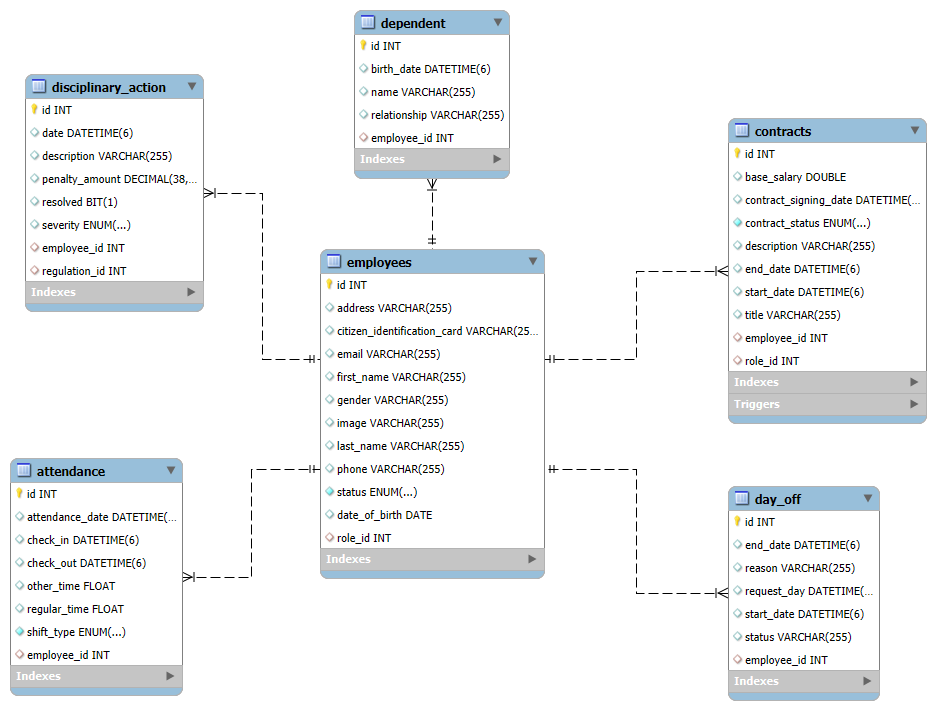
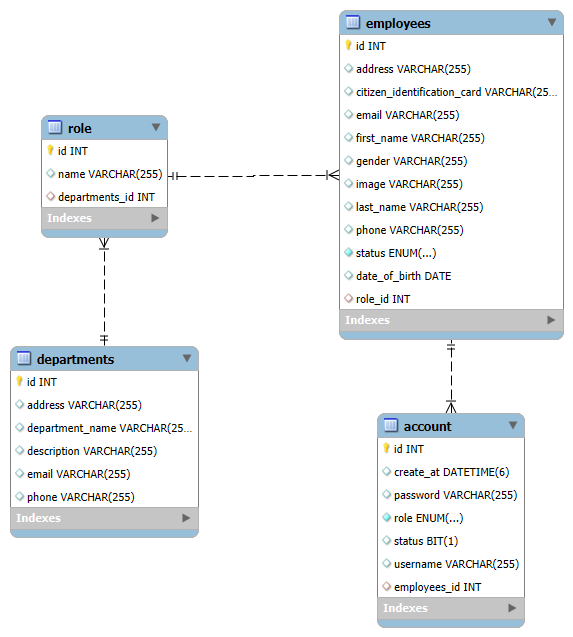
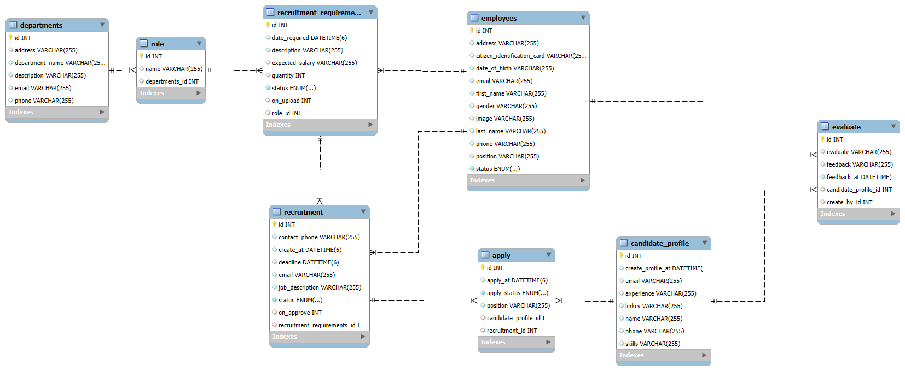
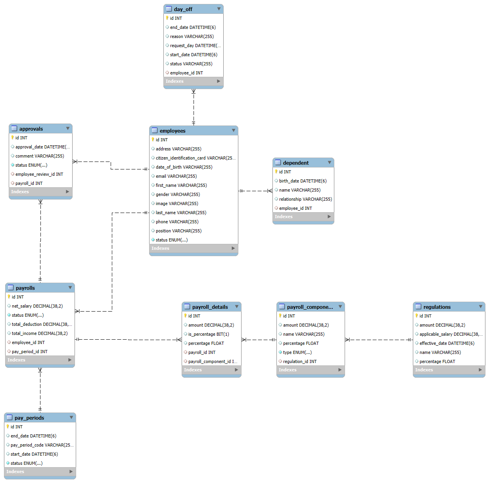
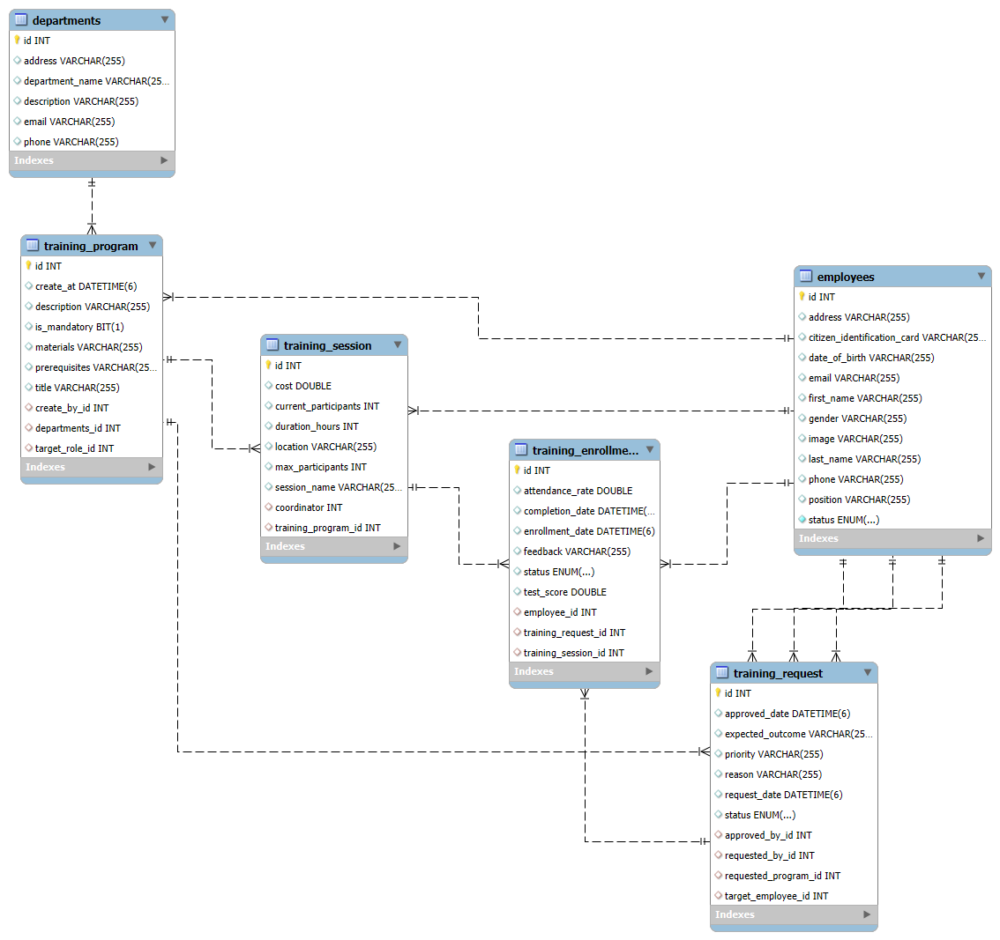
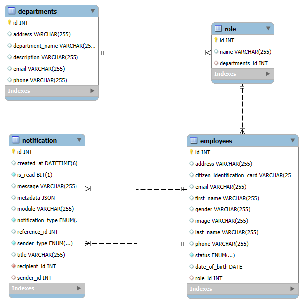
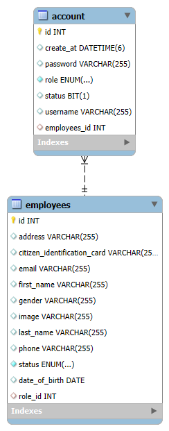

# HRM - Human Resource Management System

## 📋 Mục lục
- [Giới thiệu](#giới-thiệu)
- [Tính năng](#tính-năng)
- [Công nghệ sử dụng](#công-nghệ-sử-dụng)
- [Cài đặt](#cài-đặt)
- [Cấu hình](#cấu-hình)
- [API Documentation](#api-documentation)
- [Cấu trúc dự án](#cấu-trúc-dự-án)
- [Đóng góp](#đóng-góp)
- [Giấy phép](#giấy-phép)

## 🚀 Giới thiệu

HRM (Human Resource Management) là một hệ thống quản lý nhân sự của các phòng ban, với BE được phát triển bằng Java Spring Boot. Hệ thống cung cấp các tính năng quản lý nhân viên, quản lý phòng ban, tuyển dụng, chấm công, tính lương và đào tạo.

## 📁 Cấu trúc dự án

```
hrm/
├── src/
│   ├── main/
│   │   ├── java/
│   │   │   └── com/
│   │   │       └── project/
│   │   │           └── hrm/
|   |   |               |__ auth/                   # Module Auth
│   │   │               ├── common/                 # Feature global
│   │   │               ├── department/             # Department module 
│   │   │               ├── document/               # Document module
│   │   │               ├── employee/               # Employee module
│   │   │               ├── notification/           # Notification module
│   │   │               ├── payroll/                # Payroll module
│   │   │               ├── recruitment/            # Recruitment module
│   │   │               ├── statistics/             # Statistics module
│   │   │               └── systemRegulation/       # System Regulation module            
│   │   │               └── training/               # Training module            
│   │   └── resources/
│   │       |   └── fonts/          # Font Arial
│   │       |   └── reports/        # Create pdf 
│   │       ├── application.properties              # Config Spring boot
│   │       ├── jasperreports_extension.properties  # Config JasperReports. Dùng để tạo và xuất báo cáo
│   │       ├── logback-spring.xml                  # Logback hệ thống log của spring boot 
│   └── test/
├── pom.xml
├── README.md
└── .gitignore
```

## ✨ Tính năng

### 👥 Quản lý Nhân viên
- Quản lý thông tin cá nhân nhân viên
    + CRUD
    + Thống kê nhân viên theo phòng ban chức vụ
- Quản lý người phụ thuộc
    + CRUD
    + Kiểm tra người phụ thuộc để giảm thuế
- Quản lý hợp đồng của nhân viên
    + CRUD
    + Tự động ACTIVE, EXPIRED hợp đồng
    + Tạo báo cáo hợp đồng
    + Thống kê hợp đồng được ký theo nhân viên, phòng ban.
- Quản lý điểm danh ca làm việc
    + Check in
    + Check out
    + Thống kê theo tháng để tính lương
- Quản lý nghỉ phép của nhân viên



- Cấu trúc Module

```
|__ employee/
│   ├── controller/     # REST Controllers
│   ├── dto/            # Data Transfer Objects
│   ├── entity/         # JPA Entities
│   │   ├── Attendance.java
│   │   ├── Contracts.java
│   │   ├── DayOff.java
│   │   ├── Dependent.java
│   │   ├── DisciplinaryAction.java
│   │   ├── Employees.java
│   │   ├── Reward.java
│   ├── enums/          # Enumerations
│   ├── mapper/         # Mapper DTO Entity
│   ├── repository/     # Data Access Layer
│   ├── service/        # Business Logic
│   |    └── impl/      # Implement service
│   └── specification/  # Specification Excutor
└──../
```

### 🏢 Quản lý Tổ chức
- Quản lý phòng ban
- Quản lý vai trò và chức vụ
- Cấu trúc tổ chức phân cấp



- Cấu trúc Module

```
|__ department/
│   ├── controller/     # REST Controllers
│   ├── dto/            # Data Transfer Objects
│   ├── entity/         # JPA Entities
│   │   ├── Department.java
│   │   └── Role.java
│   ├── mapper/         # Mapper DTO Entity
│   ├── repository/     # Data Access Layer
│   ├── service/        # Business Logic
│   |    └── impl/      # Implement service
│   └── specification/  # Specification Excutor
└──../
```

### 📋 Tuyển dụng
- Quản lý yêu cầu tuyển dụng
    + CRUD đơn tuyển dụng (Recruitment Requirements)
    + CRUD bản tuyển dụng (Recruitment)
- Quản lý hồ sơ ứng viên
    + Lưu hồ sơ ưng viên
    + Thông báo Email cho ứng viên khi trúng tuyển, phỏng vấn.
- Quản lý biên bản đánh giá ứng viên



- Cấu trúc module

```
|__ recruitment/
│   ├── controller/     # REST Controllers
│   ├── dto/            # Data Transfer Objects
│   ├── entity/         # JPA Entities
│   │   ├── Apply.java
│   │   ├── CandidateProfile.java
│   │   ├── Evaluate.java
│   │   ├── Recruitment.java
│   │   ├── RecruitmentRequirements.java
│   ├── enums/          # Enumerations
│   ├── mapper/         # Mapper DTO Entity
│   ├── repository/     # Data Access Layer
│   ├── service/        # Business Logic
│   |    └── impl/      # Implement service
│   └── specifications/ # Specification Excutor
└── ../
```

### 💰 Tính lương
- Quản lý chu kỳ lương
- Tính toán các thành phần lương
- Quản lý bảng lương
- Áp dụng quy định lương
- Quản lý khen thưởng
- Quản lý kỷ luật
- Theo dõi lịch sử khen thưởng/kỷ luật



- Cấu trúc module

```
|__ payRoll/   # Quy định hệ thống
│   ├── configuration/     # Config module
│   ├── controller/     # REST Controllers
│   ├── dto/            # Data Transfer Objects
│   ├── entity/         # JPA Entities
│   │   ├── Approvals.java
│   │   ├── PayPeriods.java
│   │   ├── PayrollComponents.java
│   │   ├── Payrolls.java
│   │   └── Regulations.java
│   ├── enums/          # Enumerations
│   ├── mapper/         # Mapper DTO Entity
│   ├── repository/     # Data Access Layer
│   ├── service/        # Business Logic
│   ├──  └── impl/      # Implement service
│   └── specifications/ # Specification Excutor
│
|__ systemRegulation/   # Quy định hệ thống
│   ├── configuration/     # Config module
│   ├── controller/     # REST Controllers
│   ├── dto/            # Data Transfer Objects
│   ├── entity/         # JPA Entities
│   │   └── SystemRegulation.java
│   ├── enums/          # Enumerations
│   ├── mapper/         # Mapper DTO Entity
│   ├── repository/     # Data Access Layer
│   ├── service/        # Business Logic
│   │    └── impl/      # Implement service
└── ../
```

### 🎓 Đào tạo
- Quản lý chương trình đào tạo
- Quản lý phiên đào tạo
- Đăng ký tham gia đào tạo
- Theo dõi yêu cầu đào tạo



- Cấu trúc module

```
|__ training/
│   ├── controller/     # REST Controllers
│   ├── dto/            # Data Transfer Objects
│   ├── entity/         # JPA Entities
│   │   ├── TrainingEnrollment.java
│   │   ├── TrainingProgram.java
│   │   ├── TrainingRequest.java
│   │   └── TrainingSession.java
│   ├── enums/          # Enumerations
│   ├── mapper/         # Mapper DTO Entity
│   ├── repository/     # Data Access Layer
│   ├── service/        # Business Logic
│   ├──  └── impl/      # Implement service
│   └── specifications/ # Specification Excutor
└── ../
```

### 📄 Quản lý Tài liệu
- Quản lý tài liệu hệ thống
- Phân quyền truy cập tài liệu
- Quy trình phê duyệt tài liệu
- Lưu trữ và tìm kiếm tài liệu


- Cấu trúc module

```
|__ document/
│   ├── controller/     # REST Controllers
│   ├── dto/            # Data Transfer Objects
│   ├── entity/         # JPA Entities
│   │   ├── DocumentAccesses.java
│   │   ├── DocumentApprovals.java
│   │   ├── DocumentApprover.java
│   │   ├── Documents.java
│   │   └── DocumentTypes.java
│   ├── enums/          # Enumerations
│   ├── mapper/         # Mapper DTO Entity
│   ├── repository/     # Data Access Layer
│   ├── service/        # Business Logic
│   ├──  └── impl/      # Implement service
│   └── specifications/ # Specification Excutor
└── ../
```

### Thông báo
- Tạo thông báo toàn cục
- Tạo thông báo nội bộ phòng ban
- Thông báo cho nhân viên trong các module như training, contract, recruitment, ...



- Cấu trúc module

```
|__ notification/
│   ├── configuration/     # Config socket
│   ├── controller/     # REST Controllers
│   ├── dto/            # Data Transfer Objects
│   ├── entity/         # JPA Entities
│   │   └── Notification.java
│   ├── enums/          # Enumerations
│   ├── mapper/         # Mapper DTO Entity
│   ├── repository/     # Data Access Layer
│   ├── service/        # Business Logic
│   ├──  └── impl/      # Implement service
│   └── specifications/ # Specification Excutor
└── ../
```

### 📈 Thống kê & Báo cáo
- Thống kê nhân viên theo phòng ban
- Thống kê hợp đồng theo trạng thái
- Báo cáo tài chính
- Dashboard tổng quan

- Cấu trúc module

```
|__ notification/
│   ├── controller/     # REST Controllers
│   ├── dto/            # Interface save result query statistic
│   ├── service/        # Business Logic
│   ├──  └── impl/      # Implement service
└── ../
```

### Quản lý tài khoản
- Tạo tài khoản nhân viên
- Đăng nhập
- Quên mật khẩu
- Ngăn chặn spam dò mật khẩu 



- Cấu trúc module

```
|__ auth/
│   ├── configuration/     # Config module
│   │    ├── BruteForceAuthenticationProvider.java
│   │    └── JwtAuthenticationFilter.java
│   ├── controller/     # REST Controllers
│   ├── dto/            # Data Transfer Objects
│   ├── entity/         # JPA Entities
│   │   └── Account.java
│   ├── enums/          # Enumerations
│   ├── mapper/         # Mapper DTO Entity
│   ├── repository/     # Data Access Layer
│   ├── service/        # Business Logic
│   │    └── impl/      # Implement service
│   ├── util/           # Util
│   │   ├── JwtTokenUtil.java
│   │   ├── LoginAttemptService.java
│   │   └── OtpService.java
└── ../
```

## Cấu hình hệ thống

```
|__ common/
│   ├── configuration/    
│   │    ├── EmailAsyncConfig.java      # Config Async send Email
│   │    ├── JasperReportsConfig.java   # Config export reports
│   │    ├── RateLimitFilter.java       # Rate Limiting API
│   │    ├── RateLimitService.java
│   │    ├── SwaggerConfig.java         # Config Swagger
│   │    └── WebConfig.java             # Config Cors Mappings
│   ├── exceptions/                     # Handle Exception
│   ├── logging/                        # Logging 
│   ├── redis/                          # Config Redis template and redis key
│   ├── response/                       # Response Api
│   ├── security/                       # Security 
│   ├── service/                        # Service 
│   │    ├── impl/
│   │    ├── FileService.java           # Upload file
│   │    ├── MailService.java           # Send Email
│   │    └── RedisService.java          # Rate Service
│   └── utils/                          # Utils
└── ../
```

## 🛠️ Công nghệ sử dụng

- **Backend**: Java 21, Spring Boot 3.x
- **Database**: MySQL
- **Security**: Spring Security, JWT
- **Documentation**: Swagger/OpenAPI 3
- **Email**: Spring Mail
- **File Storage**: Cloudinary (cho hình ảnh và file)
- **Build Tool**: Maven
- **ORM**: Spring Data JPA/Hibernate

## 🔧 Cài đặt

### Yêu cầu hệ thống
- Java 21 hoặc cao hơn
- Maven 3.8+
- MySQL 8.0+

### Bước 1: Clone repository
```bash
git clone https://github.com/NKhanh0908/hrm.git
cd hrm
```

### Bước 2: Cấu hình database
Tạo database trong MySQL:
```sql
CREATE DATABASE hrm;
```

### Bước 3: Cấu hình ứng dụng
Copy file cấu hình mẫu:
```bash
cp src/main/resources/application.properties.example src/main/resources/application.properties
```

### Bước 4: Cài đặt dependencies
```bash
mvn clean install
```

### Bước 5: Chạy ứng dụng
```bash
mvn spring-boot:run
```

Ứng dụng sẽ chạy tại: `http://localhost:8080`

## ⚙️ Cấu hình

### application.properties
```properties
# Database Configuration
spring.datasource.url=jdbc:mysql://localhost:3306/hrm
spring.datasource.username=your_username
spring.datasource.password=your_password

# JPA Configuration
spring.jpa.hibernate.ddl-auto=update
spring.jpa.show-sql=true

# Mail Configuration
spring.mail.host=smtp.gmail.com
spring.mail.port=587
spring.mail.username=your_email@gmail.com
spring.mail.password=your_app_password

# File Upload Configuration
spring.servlet.multipart.max-file-size=10MB
spring.servlet.multipart.max-request-size=10MB

# Cloudinary Configuration (for image storage)
cloudinary.cloud-name=your_cloud_name
cloudinary.api-key=your_api_key
cloudinary.api-secret=your_api_secret

# Redis
spring.data.redis.host=localhost
spring.data.redis.port=6379
spring.data.redis.password=
spring.data.redis.database=0
```

### Biến môi trường
Có thể sử dụng biến môi trường cho production:
```bash
export DB_URL=jdbc:mysql://localhost:3306/hrm_db
export DB_USERNAME=your_username
export DB_PASSWORD=your_password
export MAIL_USERNAME=your_email@gmail.com
export MAIL_PASSWORD=your_app_password
```

## 📚 API Documentation

Sau khi chạy ứng dụng, truy cập Swagger UI tại:
```
http://localhost:8080/api/v1/swagger-ui/swagger-ui/index.html
```

### Các endpoint chính:

#### Authentication
- `/auth/signin` - Đăng nhập
- `/auth/signup` - Đăng ký tài khoản

#### Employees
- `/employees` - Lấy danh sách nhân viên
- `/employees` - Tạo nhân viên mới
- `/employees/{id}` - Lấy thông tin nhân viên
- `/employees/{id}` - Cập nhật thông tin nhân viên

#### Attendance
- `/attendance/checkin` - Chấm công vào
- `/attendance/checkout` - Chấm công ra
- `/attendance/employee/{id}` - Lịch sử chấm công

#### Payroll
- `/payroll/calculate` - Tính lương
- `/payroll/employee/{id}` - Bảng lương nhân viên


## 🔒 Bảo mật

- Xác thực JWT token
- Mã hóa mật khẩu bằng BCrypt
- Phân quyền dựa trên vai trò (Role-based Access Control)
- Validation đầu vào
- CORS configuration
- Rate limiting

## 📝 Logging

Ứng dụng sử dụng SLF4J với Logback:
- Log level có thể cấu hình trong `application.properties` và `logback-spring.xml`
- Log files được lưu trong thư mục `logs/`
- Rotation logs theo ngày

## 🧪 Testing
...

## 🚀 Deployment
...

### Docker

- Docker file tại nhánh deloy/docker

#### Mục lục

0. Chuẩn bị
- Cài Docker Desktop (Windows/macOS) hoặc Docker Engine + Docker Compose (Linux). Kiểm tra:

```
    docker --version
    docker-compose --version
```

1. Build image app
- Di chuyển đến thư mục D:\your_path\hrm\hrm
```
    docker build -t hrm-app .
```
+ Nếu muốn tag phiên bản:
```
    docker build -t hrm-app:0.0.1 .
```

2. Chạy đơn lẻ bằng docker run (với --link) — demo / không khuyến nghị cho production
- Trước tiên cần phải tạo thư viện .jar. Trong IntellJi:
    + Chọn Maven -> Folder dự án (ở đây là hrm) -> Lifecycle -> clean (để dọn sạch các file đã chạy)
    + Tiếp tục chọn install. IntellJi sẽ tự động tạo thư viện .jar theo version trong pom.xml 

- Pull images cần thiết
```
    docker pull mysql
    docker pull redis-server
```

- Lưu ý: --link đã deprecated. Dùng được để quick-demo, nhưng tốt hơn nên dùng Docker network hoặc docker-compose.
- Cách dùng --link để kết nối app tới MySQL và Redis đã chạy:
```
    # MySQL container
    docker run -d --name mysql-hrm-app -e MYSQL_ROOT_PASSWORD=root -e MYSQL_DATABASE=hrm-app -p 3307:3306 mysql:8.0

    # Redis container
    docker run -d --name redis-hrm-app -p 6379:6379 redis:latest
```

- link:
```
    docker run -it \
    --link mysql-hrm-app:mysql \
    --link redis-hrm-app:redis \
    -p 8080:8080 \
    hrm-app
```
3. Chạy toàn bộ (MySQL + Redis + App) bằng docker-compose — khuyến nghị
- Ví dụ docker-compose.yml đầy đủ, phù hợp dev, có volume cho MySQL, network chung, và healthcheck để giảm rủi ro app kết nối trước DB (sử dụng một script wait-for hoặc Spring Retry để đảm bảo app chờ DB chuẩn):
```
version: "3.9"

services:
  mysql-hrm-app:
    image: mysql:8.0
    container_name: mysql-hrm-app
    environment:
      MYSQL_ROOT_PASSWORD: root
      MYSQL_DATABASE: hrm-app
      # MYSQL_USER / MYSQL_PASSWORD nếu muốn user non-root
    ports:
      - "3307:3306"      # host:container (host dùng 3307 để tránh trùng local mysql)
    volumes:
      - todo-mysql-data:/var/lib/mysql
    networks:
      - hrm-net
    healthcheck:
      test: ["CMD", "mysqladmin", "ping", "-h", "127.0.0.1", "-uroot", "-proot"]
      interval: 5s
      timeout: 5s
      retries: 10

  redis-hrm-app:
    image: redis:latest
    container_name: redis-hrm-app
    command: redis-server --save "" --maxmemory 128mb --maxmemory-policy allkeys-lru
    ports:
      - "6379:6379"
    networks:
      - hrm-net
    healthcheck:
      test: ["CMD", "redis-cli", "ping"]
      interval: 5s
      timeout: 3s
      retries: 5

  server:
    build: .
    image: hrm-app
    container_name: server-hrm-app
    restart: on-failure
    ports:
      - "8080:8080"
    depends_on:
      - mysql-hrm-app
      - redis-hrm-app
    environment:
      # Trong docker-compose, app sẽ kết nối bằng tên service: mysql-hrm-app, redis-hrm-app
      SPRING_DATASOURCE_URL: jdbc:mysql://mysql-hrm-app:3306/hrm-app?useSSL=false&serverTimezone=UTC&allowPublicKeyRetrieval=true
      SPRING_DATASOURCE_USERNAME: root
      SPRING_DATASOURCE_PASSWORD: root
      SPRING_REDIS_HOST: redis-hrm-app
      SPRING_REDIS_PORT: 6379
    networks:
      - hrm-net

volumes:
  todo-mysql-data:

networks:
  hrm-net:
    driver: bridge
```

- Sau khi đã chuẩn bị chạy 
```
    docker-compose up --build
```

4. Lệnh kiểm tra & debug
```
    # Xem container đang chạy
    docker ps

    # Xem logs (theo dõi realtime)
    docker-compose logs -f
    docker logs -f server-hrm-app

    # Vào shell container
    docker exec -it server-hrm-app sh  # hoặc bash nếu image có bash

    # Vào mysql cli trong container mysql
    docker exec -it mysql-hrm-app mysql -u root -p
    # (nhập mật khẩu root)

    # Kiểm tra redis từ container app (nếu redis-cli có sẵn)
    redis-cli -h redis-hrm-app ping   # trả về PONG nếu ok
```

## 📊 Monitoring

Khuyến nghị sử dụng:
- Spring Boot Actuator cho health checks
- Micrometer với Prometheus cho metrics
- ELK Stack cho log aggregation

## 🤝 Đóng góp

1. Fork repository
2. Tạo feature branch (`git checkout -b feature/AmazingFeature`)
3. Commit changes (`git commit -m 'Add some AmazingFeature'`)
4. Push to branch (`git push origin feature/AmazingFeature`)
5. Tạo Pull Request

### Coding Standards
- Sử dụng Java Code Style chuẩn
- Viết unit tests cho các tính năng mới
- Tuân thủ nguyên tắc SOLID
- Viết javadoc cho public methods

## 📋 Changelog

### v1.0.0 (2024-01-15)
- Phiên bản đầu tiên
- Quản lý nhân viên cơ bản
- Chấm công và tính lương
- Quản lý tuyển dụng

## 🐛 Bug Reports

Nếu bạn tìm thấy lỗi, vui lòng tạo issue với:
- Mô tả lỗi chi tiết
- Các bước tái tạo lỗi
- Môi trường (OS, Java version, etc.)
- Screenshots (nếu có)

## 📞 Liên hệ

- **Email**: 
- **Website**: 
- **Documentation**:

## 📄 Giấy phép
...

**Được phát triển bởi HRM Team**